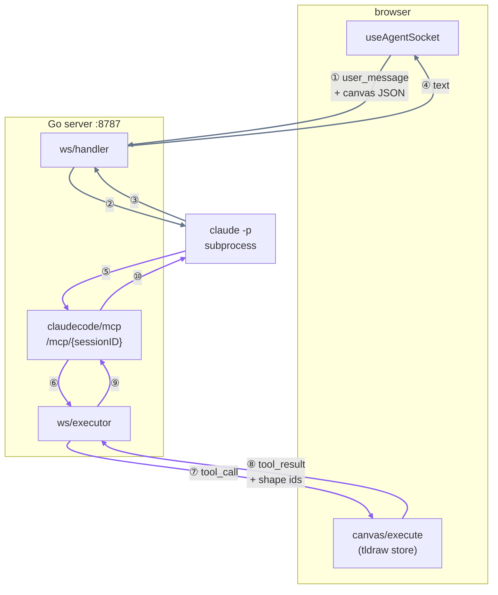

# Whiteboard Partner

A local-first AI thinking partner on an infinite canvas. Chat and canvas share one brain: the agent
can read what you've drawn and draw back.

**Stack:** React + tldraw · Go (session hub, MCP server) · SQLite · Claude Code subprocess (no API key) + MLX/Qwen3 later

## Status

Phases 0–2 of the build plan complete and verified end to end. The agent reads the canvas and draws on
it: adds shapes, connects them with arrows, relabels, deletes. Agent-drawn shapes are violet so you
can tell who drew what.

**No API key needed.** The agent is a `claude -p` subprocess authenticated by your Claude Code
subscription; canvas tools reach it through an MCP server the Go backend hosts. If `claude` is not on
PATH the canvas still works and the agent echoes your text back.

A real turn, captured from the running server:

```
you    : "Add a Postgres database below the API Gateway and connect them."
agent  : create_shape {"shape":"box","text":"Postgres","near":"shape:api","direction":"below"}
         create_arrow {"from_id":"shape:api","to_id":"shape:gen1"}
         "…one thing worth noting: a gateway talking straight to a database is unusual."
```

Note it never emits coordinates — placement is relative, and the frontend computes pixels.

## How a turn flows

The agent's loop runs *inside* Claude Code, not in the Go server. Tool calls arrive back *into* this
process over MCP, and the browser — not the backend — applies them to the canvas (D5), so the tldraw
store stays the single owner of canvas state and undo/redo works for free.



Grey is the chat path, violet the drawing path.

| Step | What crosses |
| --- | --- |
| ② | `SendTurn` — written to the subprocess stdin as `stream-json` |
| ③ | `assistant_delta` frames, streamed back as the agent talks |
| ⑤ ⑩ | JSON-RPC over HTTP POST to `/mcp/{sessionID}` — how a subprocess calls back in |
| ⑥ ⑨ | in-process `agent.ToolExecutor` call, looked up by session id |

Steps ⑤–⑩ repeat for each tool the agent calls, and it chains returned shape ids into later calls
(that is how `create_arrow` knows what to connect). Two properties of this loop are load-bearing:

- **⑤–⑩ blocks the whole time.** The tool call waits on the browser, and the reply can only arrive
  through the socket read loop — so turns are forwarded on their own goroutine. Handling them
  synchronously deadlocks every drawing turn; `TestToolCallRoundTripDoesNotDeadlock` keeps it fixed.
  The round-trip is bounded by a 30s timeout, so a closed tab fails the call instead of wedging the
  session.
- **The loop is capped** at `agent.MaxToolCallsPerTurn` (15), and Stop sends `cancel`, which cancels
  the turn context. An uncapped agent eventually redecorates the whole canvas.

## Running it

```sh
make install
make dev
```

Frontend on http://localhost:5173, server on http://localhost:8787. The canvas fills the window with
the chat panel docked right; a dot in the panel header shows the agent connection — amber connecting,
green connected, red disconnected.

## Layout

| Path | What |
| --- | --- |
| `web/` | Vite + React + tldraw. Owns the canvas and executes agent tools. |
| `server/` | Go. Owns the model loop and the WebSocket session. |
| `spikes/` | Feasibility spikes + `FINDINGS.md`; re-run after a `claude` upgrade. |

The build plan (`planv2.md`) and the decision log (`DECISIONS.md`, D1–D7) are kept local and are not
published here; references to `D2`/`D5`/`planv2 §4.2` below point at those.

## Configuration

| Variable | Default | Where |
| --- | --- | --- |
| `WHITEBOARD_ADDR` | `:8787` | server |
| `WHITEBOARD_ALLOWED_ORIGINS` | `localhost:5173` | server, comma-separated |
| `WHITEBOARD_MCP_BASE_URL` | `http://127.0.0.1:<port>` | server — where subprocesses call tools back |
| `VITE_WS_URL` | `ws://localhost:8787/ws` | web |

Requires the `claude` CLI on PATH, logged in. No API key.

## Known limits

- **Turns take ~10–30s.** Claude Code is optimised for depth, not chat latency. Fine for "critique
  this architecture", sluggish for rapid back-and-forth. A local model (planv2 §4.2) is the fix and
  is not built yet.
- **Usage is shared with your normal Claude Code work** — same subscription window. Config isolation
  keeps a turn ~6x cheaper than the naive setup; see `spikes/FINDINGS.md`.
- **The `claude` CLI is a moving dependency.** After upgrading it, re-run the spikes in `spikes/`
  before trusting sessions (planv2 §5.5). Verified against 2.1.226.

## Licensing note

tldraw is not MIT. The free tier carries a "Made with tldraw" watermark; removing it requires a paid
license. Accepted for a personal tool — see D2 in `DECISIONS.md` if this ever ships as a product.
