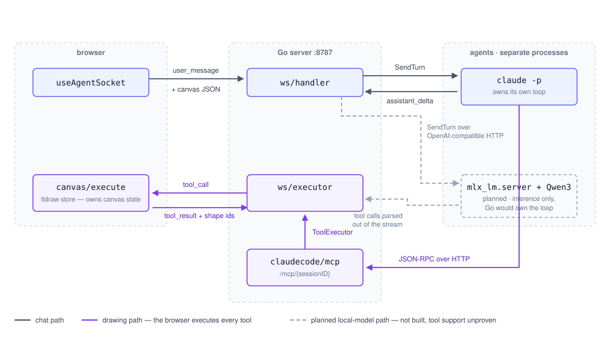

# Whiteboard Partner

A local-first AI thinking partner on an infinite canvas. Chat and canvas share one brain: the agent
can read what you've drawn and draw back.

**Stack:** React + tldraw · Go (session hub, MCP server) · SQLite · Claude Code subprocess (no API key) + MLX/Qwen3 later

## Status

Phases 0–2 of the build plan complete and verified end to end. The agent reads the canvas and draws on
it: adds shapes, connects them with arrows, relabels, deletes. Agent-drawn shapes are violet so you
can tell who drew what.

**No API key needed.** The agent is a `claude -p` subprocess authenticated by your Claude Code
subscription; canvas tools reach it through an MCP server the Go backend hosts. If `claude` is not on
PATH the canvas still works and the agent echoes your text back.

A real turn, captured from the running server:

```
you    : "Add a Postgres database below the API Gateway and connect them."
agent  : create_shape {"shape":"box","text":"Postgres","near":"shape:api","direction":"below"}
         create_arrow {"from_id":"shape:api","to_id":"shape:gen1"}
         "…one thing worth noting: a gateway talking straight to a database is unusual."
```

Note it never emits coordinates — placement is relative, and the frontend computes pixels.

## How a turn flows

The agent's loop runs *inside* Claude Code, not in the Go server. Tool calls arrive back *into* this
process over MCP, and the browser — not the backend — applies them to the canvas (D5), so the tldraw
store stays the single owner of canvas state and undo/redo works for free.

<p align="center">
  
</p>

Grey is the chat path, violet the drawing path, dashed the planned local-model path. Results travel
back the way they came: a shape id returns through `ws/executor` to the MCP response, and the agent's
text streams out to the chat panel as it arrives.

### Two agents, one interface

The dashed path is the second agent, and it is the reason `agent.AgentSession` is shaped the way it
is. The two agents put the loop on **opposite sides of the process boundary**:

| | Claude Code | MLX / Qwen3 |
| --- | --- | --- |
| Who owns the loop | Claude Code itself | our Go code (`internal/native`) |
| How tool calls arrive | pushed *in* over MCP | parsed *out of* the stream — not built |
| Transport | subprocess stdio + HTTP callback | OpenAI-compatible HTTP to `mlx_lm.server` |
| Auth | your Claude Code subscription | none — runs on your machine |
| Multi-turn memory | the subprocess, via `--resume` | ours: the endpoint is stateless |
| Status | reads and draws | reads and answers; tool loop not built (S3 passed 10/10) |

That is why the seam sits *above* the loop rather than at the model-API level: an interface at the
API level could not span both. Both implementations reach the canvas through the same
`agent.ToolExecutor`, so the browser-executes-tools half of the diagram is unchanged either way —
only the left edge differs. Nothing outside the two agent implementations may import
`anthropic`/`openai`/`mcp`/`exec` packages; that single import rule is what keeps this swappable.

**Status.** The chat half of the local agent is built and verified end to end against an
OpenAI-compatible endpoint. The drawing half is not built, but it is no longer in question: spike S3
scored **Qwen3-30B-A3B-Instruct-2507 at 10/10** on "add a box and connect it" against the real tool
schemas, median 1.5s per tool call, so the local model has earned canvas tools. Building the native
tool loop is the next step, not a gamble.

The number is worth one caveat, recorded in `spikes/FINDINGS.md`: the first 10/10 was a single
response scored ten times, because an identical prompt hits `mlx_lm.server`'s prompt cache
(`cached_tokens` 1305 of 1306, byte-identical output). The honest run varies the wording and the canvas
ids per trial and still scores 10/10, with ten distinct responses.

The violet loop repeats for each tool the agent calls, chaining returned shape ids into later calls —
that is how `create_arrow` knows what to connect. Two properties of it are load-bearing:

- **The tool call blocks the whole way round.** It waits on the browser, and the reply can only
  arrive through the socket read loop — so turns are forwarded on their own goroutine. Handling them
  synchronously deadlocks every drawing turn; `TestToolCallRoundTripDoesNotDeadlock` keeps it fixed.
  The round-trip is bounded by a 30s timeout, so a closed tab fails the call instead of wedging the
  session.
- **The loop is capped** at `agent.MaxToolCallsPerTurn` (15), and Stop sends `cancel`, which cancels
  the turn context. An uncapped agent eventually redecorates the whole canvas.

## Running it

```sh
make install
make dev
```

Frontend on http://localhost:5173, server on http://localhost:8787. The canvas fills the window with
the chat panel docked right; a dot in the panel header shows the agent connection — amber connecting,
green connected, red disconnected.

### Running against a local model

`WHITEBOARD_AGENT` picks the agent; leaving it unset autodetects (Claude Code if `claude` is on PATH,
otherwise echo). The local agent talks to any OpenAI-compatible endpoint:

```sh
mlx_lm.server --model mlx-community/Qwen3-30B-A3B-Instruct-2507-8bit --port 8080
WHITEBOARD_AGENT=local make dev
```

It is **chat-only** — it reads the canvas and answers, but does not draw. Whether it ever draws is
gated on the tool-calling spike described below.

## Layout

| Path | What |
| --- | --- |
| `web/` | Vite + React + tldraw. Owns the canvas and executes agent tools. |
| `server/` | Go. Owns the model loop and the WebSocket session. |
| `spikes/` | Feasibility spikes + `FINDINGS.md`; re-run after a `claude` upgrade. |
| `docs/turn-flow.svg` | The dataflow diagram above, hand-authored. Edit it when the protocol changes. |

The build plan (`planv2.md`) and the decision log (`DECISIONS.md`, D1–D7) are kept local and are not
published here; references to `D2`/`D5`/`planv2 §4.2` below point at those.

## Configuration

| Variable | Default | Where |
| --- | --- | --- |
| `WHITEBOARD_ADDR` | `:8787` | server |
| `WHITEBOARD_ALLOWED_ORIGINS` | `localhost:5173` | server, comma-separated |
| `WHITEBOARD_MCP_BASE_URL` | `http://127.0.0.1:<port>` | server — where subprocesses call tools back |
| `WHITEBOARD_AGENT` | autodetect | server — `local`, `echo`, or `claude` |
| `WHITEBOARD_LOCAL_BASE_URL` | `http://127.0.0.1:8080/v1` | server — OpenAI-compatible endpoint |
| `WHITEBOARD_LOCAL_MODEL` | `local` | server — model name sent to that endpoint |
| `VITE_WS_URL` | `ws://localhost:8787/ws` | web |

Requires the `claude` CLI on PATH, logged in. No API key.

## Known limits

- **Turns take ~10–30s.** Claude Code is optimised for depth, not chat latency. Fine for "critique
  this architecture", sluggish for rapid back-and-forth. The local MLX agent above is the intended
  fix and is not built yet.
- **Usage is shared with your normal Claude Code work** — same subscription window. Config isolation
  keeps a turn ~6x cheaper than the naive setup; see `spikes/FINDINGS.md`.
- **The `claude` CLI is a moving dependency.** After upgrading it, re-run the spikes in `spikes/`
  before trusting sessions (planv2 §5.5). Verified against 2.1.226.

## Licensing note

tldraw is not MIT. The free tier carries a "Made with tldraw" watermark; removing it requires a paid
license. Accepted for a personal tool — see D2 in `DECISIONS.md` if this ever ships as a product.
