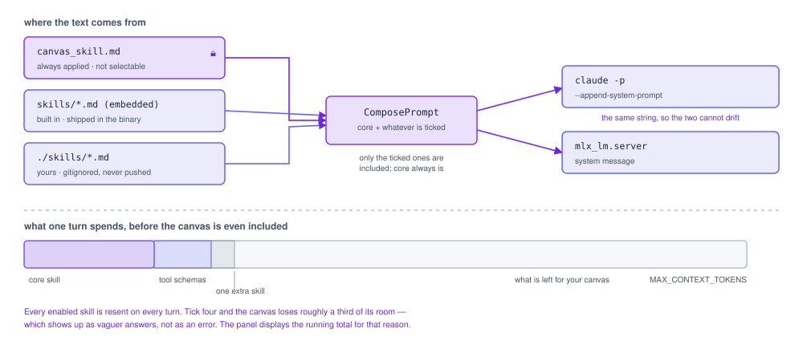
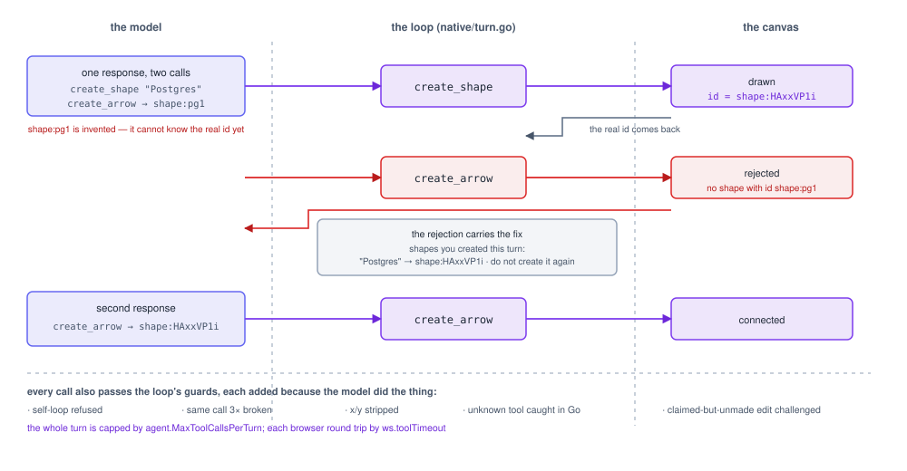

# Agent behaviour

How the agents actually behave, and the findings that shaped the loop around them.
Everything here was measured on a real canvas; `spikes/FINDINGS.md` holds the runs
and the numbers, which is why this file states behaviour rather than repeating
figures that go stale.

## Skills

  <picture>
    <source media="(prefers-color-scheme: dark)" srcset="skills-dark.svg">
    
  </picture>

What an agent knows about the canvas is markdown, not a Go string:
`server/internal/agent/canvas_skill.md`. Both agents receive it identically —
Claude Code via `--append-system-prompt`, the native loop as a system message — so
the two cannot drift.

On top of that, optional skills can be switched on per session from the chat panel.
Built-ins are embedded in the binary (`server/internal/agent/skills/`); your own
live in `./skills/*.md` and are gitignored, because they are one person's notes on
how they want their agent to behave rather than project source.

**The core canvas skill is not in the picker, deliberately.** Its rules are the
ones the code enforces — never emit coordinates, ids are not names, never claim an
edit that did not happen — so an agent without it does not read as "fewer skills",
it reads as broken. A test asserts it can never become selectable.

Two consequences worth knowing:

- **Changing skills restarts the agent.** A system prompt is fixed when a session
  starts, so there is no other way to apply one. That means a fresh thread, the
  same trade-off as switching agents, which is why the picker is disabled mid-turn.
- **Every enabled skill is resent on every turn** and competes with the canvas for
  context. The panel shows the running cost against the canvas budget, because a
  vaguer, slower agent is the symptom of overloading it and that is worth seeing
  rather than guessing at.

Factories are shared across sessions, so applying a prompt returns a *copy*
(`agent.PromptCustomiser`). Mutating the factory would leak one browser tab's skill
selection into every other tab.

## The model always guesses a new shape's id

  <picture>
    <source media="(prefers-color-scheme: dark)" srcset="tool-loop-dark.svg">
    
  </picture>

Measured on every drawing run, with both agents: asked to add a shape and connect
it, the model emits `create_shape` and `create_arrow` in the *same* response, and
the arrow references an id it invented — because the browser assigns ids and the
model cannot know one until the tool returns it.

The canvas rejects unknown ids, so the arrow fails and the model corrects on the
next iteration. That costs one extra round trip per drawing turn and it converges.

**Server-side rewriting was rejected.** Mapping "the id the model invented" onto
"the shape created just before it" would mean guessing intent and silently drawing
something the user did not ask for. An honest error plus a retry is better than
magic that is right most of the time.

## The wording of a tool result is load-bearing

Two findings that look like polish and are not:

- Told only *"created; use this id"*, the model recovered from a rejected arrow by
  calling `create_shape` **again**, duplicating the box. The result now says the
  shape *already exists*, and the duplicate stopped.
- A rejection lists the shapes created this turn as **label/id pairs**, not bare
  ids. Bare ids are interchangeable to a model, so it picked the wrong one or
  invented a third; "Add sugar → the id that box got" is matchable.

If output regresses, suspect these strings before suspecting the model.

## Guards in the loop

Each of these exists because the model did the thing:

| Guard | What it prevents |
| --- | --- |
| Self-loop rejection | `create_arrow` from a shape to itself, which the canvas draws as a degenerate arrow |
| Repeat detection | the same call three times over, burning the turn's budget on one stuck idea |
| Coordinate stripping | raw `x`/`y` silently ignored by the frontend, leaving the model believing it positioned something |
| Claimed-edit detection | narrating "Added a decision diamond" with no tool call behind it |
| Truncated-call detection | `finish_reason: tool_calls` with nothing parsed, which otherwise looks like a turn that simply ended |
| Id redaction | opaque `shape:` ids reaching the transcript, where they mean nothing to the reader |

The claimed-edit case deserves its own note: claiming work that did not happen is
worse than failing, because the canvas silently disagrees with the transcript and
the person has to notice. The loop gives the model one chance to actually do it,
then says plainly that nothing changed.

## Where each agent is stronger

**Claude Code** is better at restructuring — "re-architect this diagram", multi-step
edits that need a plan. It is slower, and its turns draw on the same subscription
window as your other work.

**The local model** is reliable at one to four calls: add, connect, relabel, delete,
"what's missing". It is fast and free. It plans shallowly, so a request to
reorganise an existing diagram tends to produce something plausible but flat, and
it needs the id retry above on nearly every drawing turn.

Practical consequence: break a large ask into steps for the local model, or switch
agents. Both are one click.

## mlx_lm is a moving dependency

The tool-call format is version-specific. The version recorded in
`spikes/FINDINGS.md` sends each tool call whole in one SSE frame rather than
fragmenting `arguments` across deltas the way the OpenAI API does. The parser
accumulates by index so it handles both, but that branch is untested against a real
fragmenting server — re-run `spikes/s3` after upgrading.

Also version-specific: whether a model's chat template is recognised at all. When
it is not, `mlx_lm` warns and **silently drops the tools**, and the model may emit
tool-call markup as plain prose. The client has a dormant fallback that parses that
markup and logs at WARN, because a silent capability loss is the worst failure mode
available.
