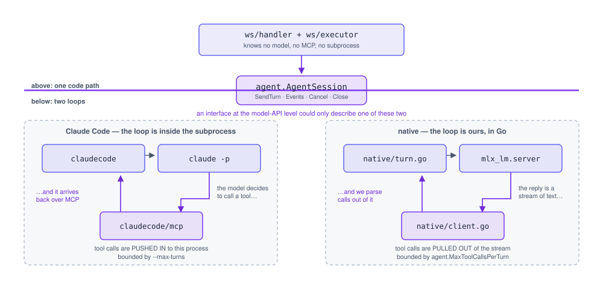

# Architecture

Why this is built the way it is. For someone changing the code — including me in
three months. The README covers what it does and how to run it.

Values, enums and schemas are deliberately not repeated here: they live in the
source and drift the moment prose copies them. Where a number matters, this cites
the identifier that holds it.

## Two agents, one interface

`agent.AgentSession` exists because the two agents put their loop on **opposite
sides of the process boundary**:

  <picture>
    <source media="(prefers-color-scheme: dark)" srcset="agent-seam-dark.svg">
    
  </picture>

| | Claude Code | MLX / Qwen3 |
| --- | --- | --- |
| Who owns the loop | Claude Code itself | our Go code (`internal/native`) |
| How tool calls arrive | pushed *in* over MCP | parsed *out of* the stream |
| Transport | subprocess stdio + HTTP callback | OpenAI-compatible HTTP to `mlx_lm.server` |
| Auth | a Claude Code subscription | none — runs locally |
| Multi-turn memory | the subprocess, via `--resume` | ours: the endpoint is stateless |
| Turn cap | `--max-turns` on the subprocess | `agent.MaxToolCallsPerTurn` |

That asymmetry is the whole reason the seam sits *above* the loop rather than at
the model-API level: an interface at the API level could not span both. An agent
whose loop we own needs cancellation, a call budget and a tool-call parser; an
agent that owns its own loop needs none of those and instead needs a callback
endpoint.

Both implementations reach the canvas through the same `agent.ToolExecutor`, so
the browser-executes-tools half of the system is identical either way — only the
left edge differs.

**The import rule:** nothing outside the two agent implementations may import
`anthropic`/`openai`/`mcp`/`exec` packages. That single rule is what makes "swap
in another model later" a config change rather than a rewrite. It is worth more
than any abstraction in the codebase and costs nothing to keep.

## The browser executes tools, not the backend

The backend streams `tool_call` frames; the frontend applies them through the
tldraw editor API and replies with `tool_result`. Two things fall out of that:

- the tldraw store is the single owner of canvas state, so undo/redo works with no
  effort from us
- one `editor.run()` per tool call means a single Cmd+Z undoes exactly one agent
  action

A backend-side headless document would be needed for multiplayer or server-side
rendering. It is not needed for this, and adding it early would mean two sources
of truth for the canvas.

## Two properties of the tool loop that are load-bearing

**A tool call blocks the whole way round.** It waits on the browser, and the reply
can only arrive through the socket read loop — so turns are forwarded on their own
goroutine. Handling them synchronously deadlocks every drawing turn. This was a
real bug, and `TestToolCallRoundTripDoesNotDeadlock` exists to keep it fixed. The
round trip is bounded by `ws.toolTimeout`, so a closed tab fails the call instead
of wedging the session.

**Several goroutines can write to one socket** — the read loop, the event
forwarder, and any in-flight tool call — so every write goes through
`session.writeMu`.

Related: `forwardEvents` exits when the agent it was started for is no longer the
session's current one. Neither agent closes its event channel on `Close` (a turn
goroutine may still be writing to it, and closing would panic), so ranging over
`Events()` alone would leak a goroutine per agent switch and leave two forwarders
writing to one socket.

## Claude Code subprocess flags

Four flags in `internal/claudecode/session.go` are not optional, and each cost an
hour to find. `spikes/FINDINGS.md` has the measurements.

| Flag | Why |
| --- | --- |
| `--permission-mode bypassPermissions` | MCP tools are not "edits"; `acceptEdits` makes the process hang silently with no error |
| `--strict-mcp-config` | without it the user's global MCP servers join the conversation |
| `--setting-sources ""` | and their plugins, skills and hooks along with them |
| empty working directory | the three above together cut a turn's cost by roughly 6x |

`ToolSearch` must be in `--allowedTools`: Claude Code may load a tool's schema
before calling it.

## Positioning: the model never emits pixels

No tool accepts coordinates. The model places shapes with `near` (an existing
shape's id) plus `direction`, and `web/src/canvas/layout.ts` computes pixels and
resolves collisions.

This is the documented failure mode of canvas-agent projects generally — models
are unreliable at absolute coordinates — so it is enforced in three places rather
than trusted once: the tool schema has no coordinate properties, the loop strips
them if they appear anyway, and a test asserts the schema never grows one.

Two sizing details that produced visible bugs: `placeRelative` must be given the
*same* size the shape is drawn at, or collision checking and drawing disagree; and
the gap between shapes has to fit a labelled arrow, because an arrow renders its
label at the connector's midpoint.

## Protocol

`web/src/agent/protocol.ts` mirrors `server/internal/ws/protocol.go`. There is no
codegen: changing a message shape means editing both files in the same commit, and
nothing will catch a drift at compile time.

One recurring hazard worth knowing: a Go nil slice marshals to JSON `null`, and
reading `.length` off it throws in the browser. That crashed the whole UI once.
Fields the frontend iterates should be sent as empty arrays.

## Diagnosing bad agent output

Triage in this order — it is faster than guessing:

| Symptom | Look at |
| --- | --- |
| Shapes in the wrong *places* | positioning: `layout.ts`, and whether size is consistent |
| Wrong *content* | the prompt: `canvas_skill.md` |
| Wrong spatial reasoning ("X is above Y" when it isn't) | the serializer: it is a format problem, fix it before adding drawing capability |
| Claims a change it did not make | the loop catches this; see `docs/agent-behaviour.md` |

Models reason about structure — arrows and bindings — far better than raw
coordinates. Lean on bindings.

## Out of scope

Voice input, multiplayer, auth, deployment, mobile, and Excalidraw integration are
cut deliberately, not pending. A model router is gated on a second consuming
project existing; building it before then is speculative plumbing.
